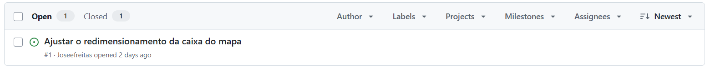
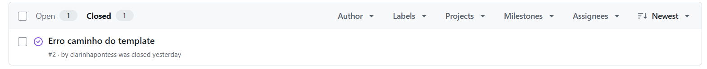
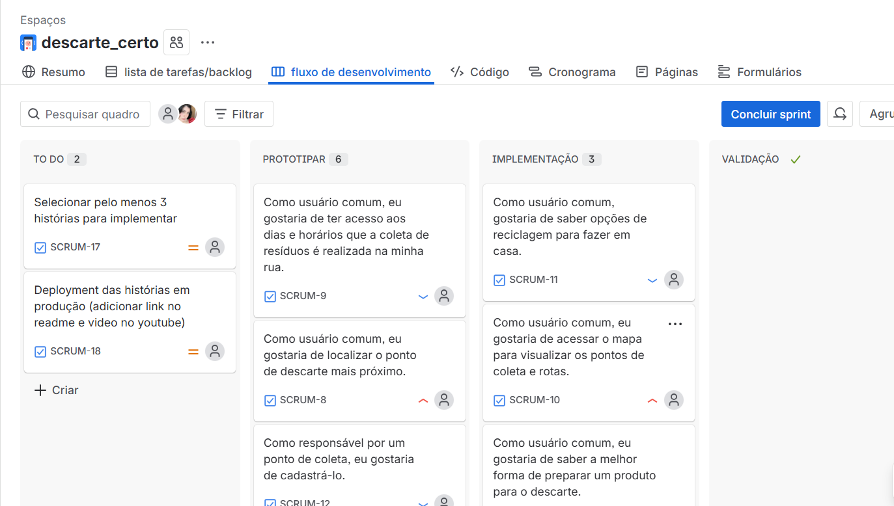
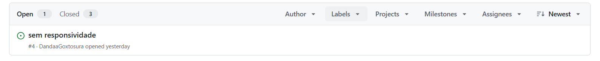
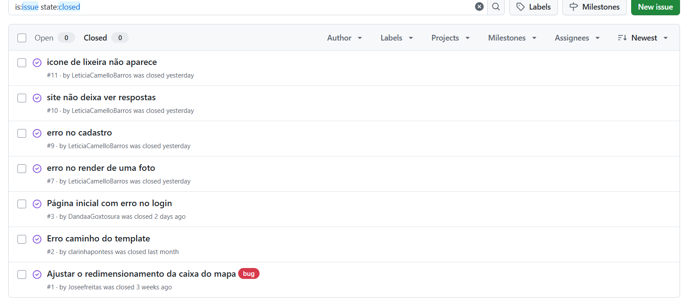
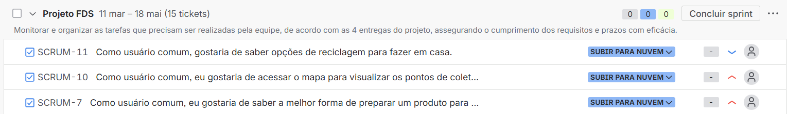
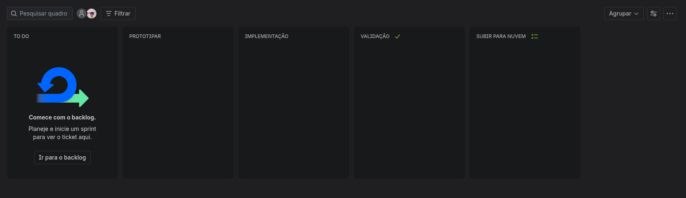
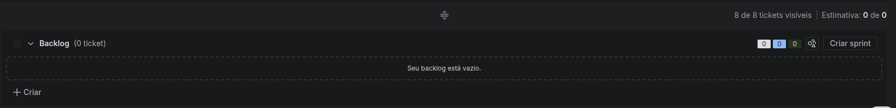
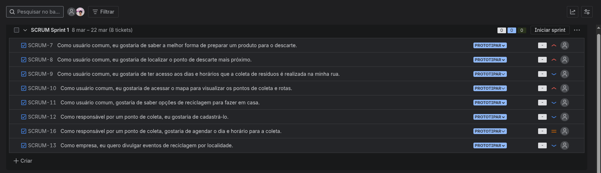

# 🌿 Descarte Certo

> Transformando o descarte de resíduos em uma ação consciente e tecnológica.

## 📌 Sobre o Projeto

O **Descarte Certo** é uma plataforma web desenvolvida em **Django** que facilita o descarte correto de resíduos, conectando cidadãos a pontos de coleta adequados e oferecendo guias de separação inteligente. O objetivo é reduzir o impacto ambiental através da informação e acessibilidade.

## 🛠️ Tecnologias Utilizadas

- **Back-end:** Python 3 / Django
- **Front-end:** HTML, CSS, JavaScript
- **Banco de Dados:** PostgreSQL
- **Deploy:** Microsoft Azure
- **testes:** Selenium 

## 👥 Equipe

| Nome | GitHub |
|------|--------|
| Eduardo | [JoseeFeitas](https://github.com/Joseefreitas) |
| Clara | [clarinhapontess](https://github.com/clarinhapontess) |
| Leticia| [LeticiaCamelloBarros ](https://github.com/LeticiaCamelloBarros) |
| Dandara | [DandaaGoxtosura](https://github.com/DandaaGoxtosura) |

## 🚀 Como Executar Localmente

```bash
git clone https://github.com/seu-usuario/descarte-certo.git
cd descarte-certo

python -m venv venv
source venv/bin/activate  # Linux/Mac
venv\Scripts\activate     # Windows

pip install -r requirements.txt
python manage.py migrate
python manage.py runserver
```

Acesse em: `http://localhost:8000`

## 🌐 Deploy

👉 [descarte-certo-axcqfwfscke0euf0.brazilsouth-01.azurewebsites.net](https://descarte-certo-axcqfwfscke0euf0.brazilsouth-01.azurewebsites.net/)

---

## 📦 Entregas do Projeto

<details>
<summary>📅 Entrega 01 - Planejamento e Protótipo (09/03)</summary>

<br>

### 📋 Documentação
- 📄 [Histórias de Usuário](https://docs.google.com/document/d/1Wt_PeB0h7rHcpQsIzcxfHMAt-mgc6cjF5P0ch-xN8cQ/edit?usp=sharing)

### 🎨 Design
- 🖼️ [Protótipo no Figma](https://www.figma.com/proto/MATJbU4Owwrt6v4ZktzZSZ/Descarte-certo---prot%C3%B3tipo?node-id=2-2&p=f&t=5JiWXhrruoVQyQoX-1&scaling=min-zoom&content-scaling=fixed&page-id=0%3A1&starting-point-node-id=2%3A2)

### 🎥 Apresentação
- ▶️ [Screencast do Protótipo](https://youtu.be/oRUKpDUxBtQ)

</details>

---

<details>
<summary>📅 Entrega 02 - Primeiras Funcionalidades (30/03)</summary>

<br>

### 🐛 Issue/Bug Tracker

**Issues Abertas**


**Issues Fechadas**


### 🎥 Screencast do Servidor
- ▶️ [Assista no YouTube](https://youtu.be/V3HxxY_-SRY)

### 👥 Programação em Par
- 📄 [Documento de Programação em Par](https://docs.google.com/document/d/1iwqeNJ4C3FlW2X-0eXM2-e5_rATPD7cKNhOl5aAS290/edit?usp=sharing)

### 📋 Quadro Sprint 02 Atualizado


</details>

---


<details>
<summary>📅 Entrega 03 - Novas Funcionalidades e Testes (27/04) </summary>

<br>


### 🎥 Novo Screencast
- ▶️ [Assista no YouTube]()

---

## 🐛 Issue/Bug Tracker Atualizado

**Issues Abertas**


**Issues Fechadas**



---

## 🧪 Testes de Sistema (E2E) Automatizados

### 🎥 Screencast dos testes
▶️ Inserir aqui o link do vídeo com a execução dos testes automatizados

- ▶️ [Assista no YouTube]()

---

## 👥 Atualização sobre Programação em Pares

- 📄 [Documento de Programação em Par](https://docs.google.com/document/d/1sKAck93-dVQePe9lxomUDlhdLKFdt41NO1dPbgR2X2M/edit?usp=sharing)

---

## 📋 Quadro da Sprint 03 Atualizado

### Print da Sprint


</details>


---

## 📊 Gestão de Projeto

| Board Geral | Backlog | Sprint Atual |
|:-----------:|:-------:|:------------:|
|  |  |  |

---
